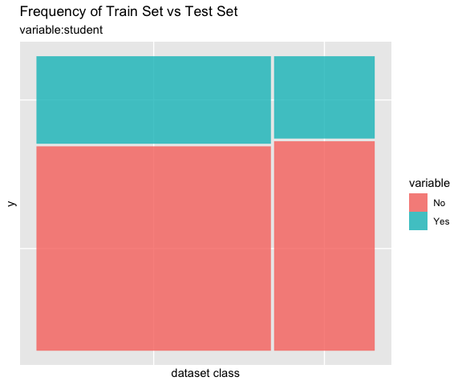
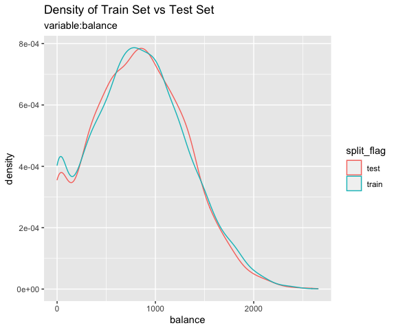
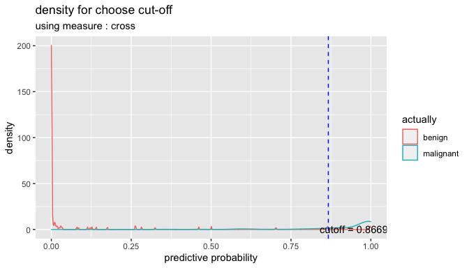
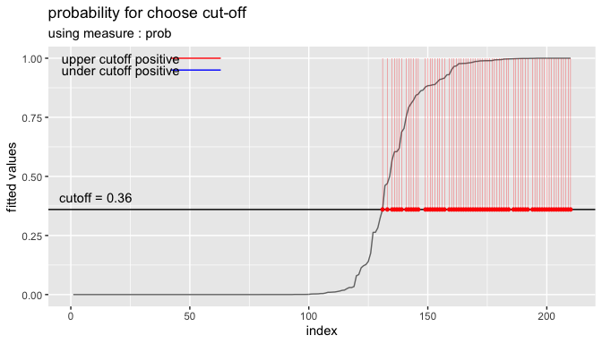

<!-- README.md is generated from README.Rmd. Please edit that file -->

# alookr 

[](https://cran.r-project.org/package=alookr)
[](https://cran.r-project.org/package=alookr)

## Overview

Binary classification modeling with `alookr`.

Features:

-   Clean and split data sets to train and test.
-   Create several representative models.
-   Evaluate the performance of the model to select the best model.
-   Support the entire process of developing a binary classification
    model.

The name `alookr` comes from `looking at the analytics process` in the
data analysis process.

## Install alookr

The released version is available on CRAN. but not yet.

``` r
install.packages("alookr")
```

Or you can get the development version without vignettes from GitHub:

``` r
devtools::install_github("choonghyunryu/alookr")
```

Or you can get the development version with vignettes from GitHub:

``` r
install.packages(c("ISLR", "spelling", "mlbench"))
devtools::install_github("choonghyunryu/alookr", build_vignettes = TRUE)
```

## Usage

alookr includes several vignette files, which we use throughout the
documentation.

Provided vignettes is as follows.

-   Cleansing the dataset
-   Split the data into a train set and a test set
-   Modeling and Evaluate, Predict

``` r
browseVignettes(package = "alookr")
```

## Cleansing the dataset

### Data: create example dataset

To illustrate basic use of the alookr package, create the `data_exam`
with sample function. The `data_exam` dataset include 5 variables.

variables are as follows.:

-   `id` : character
-   `year`: character
-   `count`: numeric
-   `alpha` : character
-   `flag` : character

``` r
# create sample dataset
set.seed(123L)
id <- sapply(1:1000, function(x)
  paste(c(sample(letters, 5), x), collapse = ""))

year <- "2018"

set.seed(123L)
count <- sample(1:10, size = 1000, replace = TRUE)

set.seed(123L)
alpha <- sample(letters, size = 1000, replace = TRUE)

set.seed(123L)
flag <- sample(c("Y", "N"), size = 1000, prob = c(0.1, 0.9), replace = TRUE)

data_exam <- data.frame(id, year, count, alpha, flag, stringsAsFactors = FALSE)

# structure of dataset
str(data_exam)
#> 'data.frame':    1000 obs. of  5 variables:
#>  $ id   : chr  "osncj1" "rvket2" "nvesi3" "chgji4" ...
#>  $ year : chr  "2018" "2018" "2018" "2018" ...
#>  $ count: int  3 3 10 2 6 5 4 6 9 10 ...
#>  $ alpha: chr  "o" "s" "n" "c" ...
#>  $ flag : chr  "N" "N" "N" "N" ...

# summary of dataset
summary(data_exam)
#>       id                year               count           alpha          
#>  Length:1000        Length:1000        Min.   : 1.000   Length:1000       
#>  Class :character   Class :character   1st Qu.: 3.000   Class :character  
#>  Mode  :character   Mode  :character   Median : 6.000   Mode  :character  
#>                                        Mean   : 5.698                     
#>                                        3rd Qu.: 8.000                     
#>                                        Max.   :10.000                     
#>      flag          
#>  Length:1000       
#>  Class :character  
#>  Mode  :character  
#>                    
#>                    
#> 
```

### Clean dataset

`cleanse()` cleans up the dataset before fitting the classification
model.

The function of cleanse() is as follows.:

-   remove variables whose unique value is one
-   remove variables with high unique rate
-   converts character variables to factor
-   remove variables with missing value

#### Cleanse dataset with `cleanse()`

For example, we can cleanse all variables in `data_exam`:

``` r
library(alookr)
#> Loading required package: ggplot2
#> Loading required package: randomForest
#> randomForest 4.6-14
#> Type rfNews() to see new features/changes/bug fixes.
#> 
#> Attaching package: 'randomForest'
#> The following object is masked from 'package:ggplot2':
#> 
#>     margin

# cleansing dataset
newDat <- cleanse(data_exam)
#> ── Checking unique value ─────────────────────────── unique value is one ──
#> remove variables that unique value is one
#> ● year
#> 
#> ── Checking unique rate ─────────────────────────────── high unique rate ──
#> remove variables with high unique rate
#> ● id = 1000(1)
#> 
#> ── Checking character variables ─────────────────────── categorical data ──
#> converts character variables to factor
#> ● alpha
#> ● flag

# structure of cleansing dataset
str(newDat)
#> 'data.frame':    1000 obs. of  3 variables:
#>  $ count: int  3 3 10 2 6 5 4 6 9 10 ...
#>  $ alpha: Factor w/ 26 levels "a","b","c","d",..: 15 19 14 3 10 18 22 11 5 20 ...
#>  $ flag : Factor w/ 2 levels "N","Y": 1 1 1 1 2 1 1 1 1 1 ...
```

-   `remove variables whose unique value is one` : The year variable has
    only one value, “2018”. Not needed when fitting the model. So it was
    removed.
-   `remove variables with high unique rate` : If the number of levels
    of categorical data is very large, it is not suitable for
    classification model. In this case, it is highly likely to be an
    identifier of the data. So, remove the categorical (or character)
    variable with a high value of the unique rate defined as “number of
    levels / number of observations”.
    -   The unique rate of the id variable with the number of levels of
        1000 is 1. This variable is the object of the removal by
        identifier.
    -   The unique rate of the alpha variable is 0.026 and this variable
        is also removed.
-   `converts character variables to factor` : The character type flag
    variable is converted to a factor type.

For example, we can not remove the categorical data that is removed by
changing the threshold of the `unique rate`:

``` r
# cleansing dataset
newDat <- cleanse(data_exam, uniq_thres = 0.03)
#> ── Checking unique value ─────────────────────────── unique value is one ──
#> remove variables that unique value is one
#> ● year
#> 
#> ── Checking unique rate ─────────────────────────────── high unique rate ──
#> remove variables with high unique rate
#> ● id = 1000(1)
#> 
#> ── Checking character variables ─────────────────────── categorical data ──
#> converts character variables to factor
#> ● alpha
#> ● flag

# structure of cleansing dataset
str(newDat)
#> 'data.frame':    1000 obs. of  3 variables:
#>  $ count: int  3 3 10 2 6 5 4 6 9 10 ...
#>  $ alpha: Factor w/ 26 levels "a","b","c","d",..: 15 19 14 3 10 18 22 11 5 20 ...
#>  $ flag : Factor w/ 2 levels "N","Y": 1 1 1 1 2 1 1 1 1 1 ...
```

The `alpha` variable was not removed.

If you do not want to apply a unique rate, you can set the value of the
`uniq` argument to FALSE.:

``` r
# cleansing dataset
newDat <- cleanse(data_exam, uniq = FALSE)
#> ── Checking character variables ─────────────────────── categorical data ──
#> converts character variables to factor
#> ● id
#> ● year
#> ● alpha
#> ● flag

# structure of cleansing dataset
str(newDat)
#> 'data.frame':    1000 obs. of  5 variables:
#>  $ id   : Factor w/ 1000 levels "ablnc282","abqym54",..: 594 715 558 94 727 270 499 882 930 515 ...
#>  $ year : Factor w/ 1 level "2018": 1 1 1 1 1 1 1 1 1 1 ...
#>  $ count: int  3 3 10 2 6 5 4 6 9 10 ...
#>  $ alpha: Factor w/ 26 levels "a","b","c","d",..: 15 19 14 3 10 18 22 11 5 20 ...
#>  $ flag : Factor w/ 2 levels "N","Y": 1 1 1 1 2 1 1 1 1 1 ...
```

If you do not want to force type conversion of a character variable to
factor, you can set the value of the `char` argument to FALSE.:

``` r
# cleansing dataset
newDat <- cleanse(data_exam, char = FALSE)
#> ── Checking unique value ─────────────────────────── unique value is one ──
#> remove variables that unique value is one
#> ● year
#> 
#> ── Checking unique rate ─────────────────────────────── high unique rate ──
#> remove variables with high unique rate
#> ● id = 1000(1)

# structure of cleansing dataset
str(newDat)
#> 'data.frame':    1000 obs. of  3 variables:
#>  $ count: int  3 3 10 2 6 5 4 6 9 10 ...
#>  $ alpha: chr  "o" "s" "n" "c" ...
#>  $ flag : chr  "N" "N" "N" "N" ...
```

If you want to remove a variable that contains missing values, specify
the value of the `missing` argument as TRUE. The following example
**removes the flag variable** that contains the missing value.

``` r
data_exam$flag[1] <- NA 

# cleansing dataset
newDat <- cleanse(data_exam, missing = TRUE)
#> ── Checking missing value ────────────────────────────────── included NA ──
#> remove variables whose included NA
#> ● flag
#> 
#> ── Checking unique value ─────────────────────────── unique value is one ──
#> remove variables that unique value is one
#> ● year
#> 
#> ── Checking unique rate ─────────────────────────────── high unique rate ──
#> remove variables with high unique rate
#> ● id = 1000(1)
#> 
#> ── Checking character variables ─────────────────────── categorical data ──
#> converts character variables to factor
#> ● alpha

# structure of cleansing dataset
str(newDat)
#> 'data.frame':    1000 obs. of  2 variables:
#>  $ count: int  3 3 10 2 6 5 4 6 9 10 ...
#>  $ alpha: Factor w/ 26 levels "a","b","c","d",..: 15 19 14 3 10 18 22 11 5 20 ...
```

### Diagnosis and removal of highly correlated variables

In the linear model, there is a multicollinearity if there is a strong
correlation between independent variables. So it is better to remove one
variable from a pair of variables where the correlation exists.

Even if it is not a linear model, removing one variable from a strongly
correlated pair of variables can also reduce the overhead of the
operation. It is also easy to interpret the model.

#### Cleanse dataset with `treatment_corr()`

`treatment_corr()` diagnose pairs of highly correlated variables or
remove on of them.

`treatment_corr()` calculates correlation coefficient of pearson for
numerical variable, and correlation coefficient of spearman for
categorical variable.

For example, we can diagnosis and removal of highly correlated
variables:

``` r
# numerical variable
x1 <- 1:100
set.seed(12L)
x2 <- sample(1:3, size = 100, replace = TRUE) * x1 + rnorm(1)
set.seed(1234L)
x3 <- sample(1:2, size = 100, replace = TRUE) * x1 + rnorm(1)

# categorical variable
x4 <- factor(rep(letters[1:20], time = 5))
set.seed(100L)
x5 <- factor(rep(letters[1:20 + sample(1:6, size = 20, replace = TRUE)], time = 5))
set.seed(200L)
x6 <- factor(rep(letters[1:20 + sample(1:3, size = 20, replace = TRUE)], time = 5))
set.seed(300L)
x7 <- factor(sample(letters[1:5], size = 100, replace = TRUE))

exam <- data.frame(x1, x2, x3, x4, x5, x6, x7)
str(exam)
#> 'data.frame':    100 obs. of  7 variables:
#>  $ x1: int  1 2 3 4 5 6 7 8 9 10 ...
#>  $ x2: num  2.55 4.55 9.55 12.55 10.55 ...
#>  $ x3: num  0.194 2.194 4.194 6.194 3.194 ...
#>  $ x4: Factor w/ 20 levels "a","b","c","d",..: 1 2 3 4 5 6 7 8 9 10 ...
#>  $ x5: Factor w/ 13 levels "c","e","f","g",..: 1 5 3 2 4 7 6 8 9 8 ...
#>  $ x6: Factor w/ 15 levels "c","d","f","g",..: 1 2 3 4 3 5 6 7 8 9 ...
#>  $ x7: Factor w/ 5 levels "a","b","c","d",..: 2 2 1 4 5 1 4 3 1 5 ...
head(exam)
#>   x1        x2         x3 x4 x5 x6 x7
#> 1  1  2.554297  0.1939687  a  c  c  b
#> 2  2  4.554297  2.1939687  b  h  d  b
#> 3  3  9.554297  4.1939687  c  f  f  a
#> 4  4 12.554297  6.1939687  d  e  g  d
#> 5  5 10.554297  3.1939687  e  g  f  e
#> 6  6  6.554297 10.1939687  f  l  h  a

# default case
exam_01 <- treatment_corr(exam)
#> * remove variables whose strong correlation (pearson >= 0.8)
#>  - remove x1 : with x3 (0.825)
#> * remove variables whose strong correlation (spearman >= 0.8)
#>  - remove x4 : with x5 (0.9649)
#>  - remove x4 : with x6 (0.9928)
#>  - remove x5 : with x6 (0.9485)
head(exam_01)
#>          x2         x3 x6 x7
#> 1  2.554297  0.1939687  c  b
#> 2  4.554297  2.1939687  d  b
#> 3  9.554297  4.1939687  f  a
#> 4 12.554297  6.1939687  g  d
#> 5 10.554297  3.1939687  f  e
#> 6  6.554297 10.1939687  h  a

# not removing variables
treatment_corr(exam, treat = FALSE)
#> * remove variables whose strong correlation (pearson >= 0.8)
#>  - remove x1 : with x3 (0.825)
#> * remove variables whose strong correlation (spearman >= 0.8)
#>  - remove x4 : with x5 (0.9649)
#>  - remove x4 : with x6 (0.9928)
#>  - remove x5 : with x6 (0.9485)

# Set a threshold to detecting variables when correlation greater then 0.9
treatment_corr(exam, corr_thres = 0.9, treat = FALSE)
#> * remove variables whose strong correlation (spearman >= 0.9)
#>  - remove x4 : with x5 (0.9649)
#>  - remove x4 : with x6 (0.9928)
#>  - remove x5 : with x6 (0.9485)

# not verbose mode
exam_02 <- treatment_corr(exam, verbose = FALSE)
head(exam_02)
#>          x2         x3 x6 x7
#> 1  2.554297  0.1939687  c  b
#> 2  4.554297  2.1939687  d  b
#> 3  9.554297  4.1939687  f  a
#> 4 12.554297  6.1939687  g  d
#> 5 10.554297  3.1939687  f  e
#> 6  6.554297 10.1939687  h  a
```

-   `remove variables whose strong correlation` : x1, x4, x5 are
    removed.

## Split the data into a train set and a test set

### Data: Credit Card Default Data

`Default` of `ISLR package` is a simulated data set containing
information on ten thousand customers. The aim here is to predict which
customers will default on their credit card debt.

A data frame with 10000 observations on the following 4 variables.:

-   `default` : factor. A factor with levels No and Yes indicating
    whether the customer defaulted on their debt
-   `student`: factor. A factor with levels No and Yes indicating
    whether the customer is a student
-   `balance`: numeric. The average balance that the customer has
    remaining on their credit card after making their monthly payment
-   `income` : numeric. Income of customer

``` r
# Credit Card Default Data
head(ISLR::Default)
#>   default student   balance    income
#> 1      No      No  729.5265 44361.625
#> 2      No     Yes  817.1804 12106.135
#> 3      No      No 1073.5492 31767.139
#> 4      No      No  529.2506 35704.494
#> 5      No      No  785.6559 38463.496
#> 6      No     Yes  919.5885  7491.559

# structure of dataset
str(ISLR::Default)
#> 'data.frame':    10000 obs. of  4 variables:
#>  $ default: Factor w/ 2 levels "No","Yes": 1 1 1 1 1 1 1 1 1 1 ...
#>  $ student: Factor w/ 2 levels "No","Yes": 1 2 1 1 1 2 1 2 1 1 ...
#>  $ balance: num  730 817 1074 529 786 ...
#>  $ income : num  44362 12106 31767 35704 38463 ...

# summary of dataset
summary(ISLR::Default)
#>  default    student       balance           income     
#>  No :9667   No :7056   Min.   :   0.0   Min.   :  772  
#>  Yes: 333   Yes:2944   1st Qu.: 481.7   1st Qu.:21340  
#>                        Median : 823.6   Median :34553  
#>                        Mean   : 835.4   Mean   :33517  
#>                        3rd Qu.:1166.3   3rd Qu.:43808  
#>                        Max.   :2654.3   Max.   :73554
```

### Split dataset

`split_by()` splits the data.frame or tbl\_df into a training set and a
test set.

#### Split dataset with `split_by()`

The `split_df` class is created, which contains the split information
and criteria to separate the training and the test set.

``` r
library(alookr)
library(dplyr)

# Generate data for the example
sb <- ISLR::Default %>%
  split_by(default, seed = 6534)

sb
#> # A tibble: 10,000 x 5
#> # Groups:   split_flag [2]
#>    default student balance income split_flag
#>    <fct>   <fct>     <dbl>  <dbl> <chr>     
#>  1 No      No         730. 44362. train     
#>  2 No      Yes        817. 12106. train     
#>  3 No      No        1074. 31767. train     
#>  4 No      No         529. 35704. train     
#>  5 No      No         786. 38463. test      
#>  6 No      Yes        920.  7492. train     
#>  7 No      No         826. 24905. test      
#>  8 No      Yes        809. 17600. train     
#>  9 No      No        1161. 37469. train     
#> 10 No      No           0  29275. train     
#> # … with 9,990 more rows
```

The attributes of the `split_df` class are as follows.:

-   split\_seed : integer. random seed used for splitting
-   target : character. the name of the target variable
-   binary : logical. whether the target variable is binary class
-   minority : character. the name of the minority class
-   majority : character. the name of the majority class
-   minority\_rate : numeric. the rate of the minority class
-   majority\_rate : numeric. the rate of the majority class

``` r
attr_names <- names(attributes(sb))
attr_names
#>  [1] "names"         "row.names"     "groups"        "class"        
#>  [5] "split_seed"    "target"        "binary"        "minority"     
#>  [9] "majority"      "minority_rate" "majority_rate"

sb_attr <- attributes(sb)

# The third property, row.names, is excluded from the output because its length is very long.
sb_attr[!attr_names %in% "row.names"]
#> $names
#> [1] "default"    "student"    "balance"    "income"     "split_flag"
#> 
#> $groups
#> # A tibble: 2 x 2
#>   split_flag       .rows
#> * <chr>      <list<int>>
#> 1 test           [3,000]
#> 2 train          [7,000]
#> 
#> $class
#> [1] "split_df"   "grouped_df" "tbl_df"     "tbl"        "data.frame"
#> 
#> $split_seed
#> [1] 6534
#> 
#> $target
#>   default 
#> "default" 
#> 
#> $binary
#> [1] TRUE
#> 
#> $minority
#> [1] "Yes"
#> 
#> $majority
#> [1] "No"
#> 
#> $minority_rate
#>    Yes 
#> 0.0333 
#> 
#> $majority_rate
#>     No 
#> 0.9667
```

`summary()` summarizes the information of two datasets splitted by
`split_by()`.

``` r
summary(sb)
#> ** Split train/test set information **
#>  + random seed        :  6534 
#>  + split data            
#>     - train set count :  7000 
#>     - test set count  :  3000 
#>  + target variable    :  default 
#>     - minority class  :  Yes (0.033300)
#>     - majority class  :  No (0.966700)
```

### Compare dataset

Train data and test data should be similar. If the two datasets are not
similar, the performance of the predictive model may be reduced.

`alookr` provides a function to compare the similarity between train
dataset and test dataset.

If the two data sets are not similar, the train dataset and test dataset
should be splitted again from the original data.

#### Comparison of categorical variables with `compare_target_category()`

Compare the statistics of the categorical variables of the train set and
test set included in the “split\_df” class.

``` r
sb %>%
  compare_target_category()
#> # A tibble: 4 x 5
#>   variable level train  test abs_diff
#>   <chr>    <fct> <dbl> <dbl>    <dbl>
#> 1 default  No    96.7  96.7   0.00476
#> 2 default  Yes    3.33  3.33  0.00476
#> 3 student  No    70.0  71.8   1.77   
#> 4 student  Yes   30.0  28.2   1.77

# compare variables that are character data types.
sb %>%
  compare_target_category(add_character = TRUE)
#> # A tibble: 4 x 5
#>   variable level train  test abs_diff
#>   <chr>    <fct> <dbl> <dbl>    <dbl>
#> 1 default  No    96.7  96.7   0.00476
#> 2 default  Yes    3.33  3.33  0.00476
#> 3 student  No    70.0  71.8   1.77   
#> 4 student  Yes   30.0  28.2   1.77

# display marginal
sb %>%
  compare_target_category(margin = TRUE)
#> # A tibble: 6 x 5
#>   variable level    train   test abs_diff
#>   <chr>    <fct>    <dbl>  <dbl>    <dbl>
#> 1 default  No       96.7   96.7   0.00476
#> 2 default  Yes       3.33   3.33  0.00476
#> 3 default  <Total> 100    100     0.00952
#> 4 student  No       70.0   71.8   1.77   
#> 5 student  Yes      30.0   28.2   1.77   
#> 6 student  <Total> 100    100     3.54

# student variable only
sb %>%
  compare_target_category(student)
#> # A tibble: 2 x 5
#>   variable level train  test abs_diff
#>   <chr>    <fct> <dbl> <dbl>    <dbl>
#> 1 student  No     70.0  71.8     1.77
#> 2 student  Yes    30.0  28.2     1.77

sb %>%
  compare_target_category(student, margin = TRUE)
#> # A tibble: 3 x 5
#>   variable level   train  test abs_diff
#>   <chr>    <fct>   <dbl> <dbl>    <dbl>
#> 1 student  No       70.0  71.8     1.77
#> 2 student  Yes      30.0  28.2     1.77
#> 3 student  <Total> 100   100       3.54
```

compare\_target\_category() returns tbl\_df, where the variables have
the following.:

-   variable : character. categorical variable name
-   level : factor. level of categorical variables
-   train : numeric. the relative frequency of the level in the train
    set
-   test : numeric. the relative frequency of the level in the test set
-   abs\_diff : numeric. the absolute value of the difference between
    two relative frequencies

#### Comparison of numeric variables with `compare_target_numeric()`

Compare the statistics of the numerical variables of the train set and
test set included in the “split\_df” class.

``` r
sb %>%
  compare_target_numeric()
#> # A tibble: 2 x 7
#>   variable train_mean test_mean train_sd test_sd train_z test_z
#>   <chr>         <dbl>     <dbl>    <dbl>   <dbl>   <dbl>  <dbl>
#> 1 balance        836.      834.     487.    477.    1.72   1.75
#> 2 income       33446.    33684.   13437.  13101.    2.49   2.57

# balance variable only
sb %>%
  compare_target_numeric(balance)
#> # A tibble: 1 x 7
#>   variable train_mean test_mean train_sd test_sd train_z test_z
#>   <chr>         <dbl>     <dbl>    <dbl>   <dbl>   <dbl>  <dbl>
#> 1 balance        836.      834.     487.    477.    1.72   1.75
```

compare\_target\_numeric() returns tbl\_df, where the variables have the
following.:

-   variable : character. numeric variable name
-   train\_mean : numeric. arithmetic mean of train set
-   test\_mean : numeric. arithmetic mean of test set
-   train\_sd : numeric. standard deviation of train set
-   test\_sd : numeric. standard deviation of test set
-   train\_z : numeric. the arithmetic mean of the train set divided by
    the standard deviation
-   test\_z : numeric. the arithmetic mean of the test set divided by
    the standard deviation

#### Comparison plot with `compare_plot()`

Plot compare information of the train set and test set included in the
“split\_df” class.

``` r
# income variable only
sb %>%
  compare_plot("income")
```

<!-- -->

``` r
# all varibales
sb %>%
  compare_plot()
```

<!-- --><!-- --><!-- --><!-- -->

#### Diagnosis of train set and test set with `compare_diag()`

Diagnosis of similarity between datasets splitted by train set and set
included in the “split\_df” class.

``` r
defaults <- ISLR::Default
defaults$id <- seq(NROW(defaults))

set.seed(1)
defaults[sample(seq(NROW(defaults)), 3), "student"] <- NA
set.seed(2)
defaults[sample(seq(NROW(defaults)), 10), "balance"] <- NA

sb_2 <- defaults %>%
  split_by(default)

sb_2 %>%
  compare_diag()
#> * Detected diagnose missing value
#>  - student
#>  - balance
#>  - balance
#> 
#> * Detected diagnose missing levels
#>  - student
#> $missing_value
#> # A tibble: 3 x 4
#>   variables train_misscount train_missrate test_missrate
#>   <chr>               <int>          <dbl>         <dbl>
#> 1 student                 3         0.0429       NA     
#> 2 balance                 8         0.114        NA     
#> 3 balance                 2        NA             0.0667
#> 
#> $single_value
#> # A tibble: 0 x 3
#> # … with 3 variables: variables <chr>, train_uniq <lgl>, test_uniq <lgl>
#> 
#> $uniq_rate
#> # A tibble: 0 x 5
#> # … with 5 variables: variables <chr>, train_uniqcount <int>,
#> #   train_uniqrate <dbl>, test_uniqcount <int>, test_uniqrate <dbl>
#> 
#> $missing_level
#> # A tibble: 1 x 4
#>   variables n_levels train_missing_nlevel test_missing_nlevel
#>   <chr>        <int>                <int>               <int>
#> 1 student          3                    0                   1

sb_2 %>%
  compare_diag(add_character = TRUE)
#> * Detected diagnose missing value
#>  - student
#>  - balance
#>  - balance
#> 
#> * Detected diagnose missing levels
#>  - student
#> $missing_value
#> # A tibble: 3 x 4
#>   variables train_misscount train_missrate test_missrate
#>   <chr>               <int>          <dbl>         <dbl>
#> 1 student                 3         0.0429       NA     
#> 2 balance                 8         0.114        NA     
#> 3 balance                 2        NA             0.0667
#> 
#> $single_value
#> # A tibble: 0 x 3
#> # … with 3 variables: variables <chr>, train_uniq <lgl>, test_uniq <lgl>
#> 
#> $uniq_rate
#> # A tibble: 0 x 5
#> # … with 5 variables: variables <chr>, train_uniqcount <int>,
#> #   train_uniqrate <dbl>, test_uniqcount <int>, test_uniqrate <dbl>
#> 
#> $missing_level
#> # A tibble: 1 x 4
#>   variables n_levels train_missing_nlevel test_missing_nlevel
#>   <chr>        <int>                <int>               <int>
#> 1 student          3                    0                   1

sb_2 %>%
  compare_diag(uniq_thres = 0.0005)
#> * Detected diagnose missing value
#>  - student
#>  - balance
#>  - balance
#> 
#> * Detected diagnose many unique value
#>  - default
#>  - student
#> 
#> * Detected diagnose missing levels
#>  - student
#> $missing_value
#> # A tibble: 3 x 4
#>   variables train_misscount train_missrate test_missrate
#>   <chr>               <int>          <dbl>         <dbl>
#> 1 student                 3         0.0429       NA     
#> 2 balance                 8         0.114        NA     
#> 3 balance                 2        NA             0.0667
#> 
#> $single_value
#> # A tibble: 0 x 3
#> # … with 3 variables: variables <chr>, train_uniq <lgl>, test_uniq <lgl>
#> 
#> $uniq_rate
#> # A tibble: 2 x 5
#>   variables train_uniqcount train_uniqrate test_uniqcount test_uniqrate
#>   <chr>               <int>          <dbl>          <int>         <dbl>
#> 1 default                NA             NA              2      0.000667
#> 2 student                NA             NA              2      0.000667
#> 
#> $missing_level
#> # A tibble: 1 x 4
#>   variables n_levels train_missing_nlevel test_missing_nlevel
#>   <chr>        <int>                <int>               <int>
#> 1 student          3                    0                   1
```

### Extract train/test dataset

If you compare the train set with the test set and find that the two
datasets are similar, extract the data from the split\_df object.

#### Extract train set or test set with `extract_set()`

Extract train set or test set from split\_df class object.

``` r
train <- sb %>%
  extract_set(set = "train")

test <- sb %>%
  extract_set(set = "test")

dim(train)
#> [1] 7000    4

dim(test)
#> [1] 3000    4
```

#### Extract the data to fit the model with `sampling_target()`

In a target class, the ratio of the majority class to the minority class
is not similar and the ratio of the minority class is very small, which
is called the `imbalanced class`.

If target variable is an imbalanced class, the characteristics of the
majority class are actively reflected in the model. This model implies
an error in predicting the minority class as the majority class. So we
have to make the train dataset a balanced class.

`sampling_target()` performs sampling on the train set of split\_df to
resolve the imbalanced class.

``` r
# under-sampling with random seed
under <- sb %>%
  sampling_target(seed = 1234L)

under %>%
  count(default)
#> # A tibble: 2 x 2
#>   default     n
#>   <fct>   <int>
#> 1 No        233
#> 2 Yes       233

# under-sampling with random seed, and minority class frequency is 40%
under40 <- sb %>%
  sampling_target(seed = 1234L, perc = 40)

under40 %>%
  count(default)
#> # A tibble: 2 x 2
#>   default     n
#>   <fct>   <int>
#> 1 No        349
#> 2 Yes       233

# over-sampling with random seed
over <- sb %>%
  sampling_target(method = "ubOver", seed = 1234L)

over %>%
  count(default)
#> # A tibble: 2 x 2
#>   default     n
#>   <fct>   <int>
#> 1 No       6767
#> 2 Yes      6767

# over-sampling with random seed, and k = 10
over10 <- sb %>%
  sampling_target(method = "ubOver", seed = 1234L, k = 10)

over10 %>%
  count(default)
#> # A tibble: 2 x 2
#>   default     n
#>   <fct>   <int>
#> 1 No       6767
#> 2 Yes      2330

# SMOTE with random seed
smote <- sb %>%
  sampling_target(method = "ubSMOTE", seed = 1234L)

smote %>%
  count(default)
#> # A tibble: 2 x 2
#>   default     n
#>   <fct>   <int>
#> 1 No        932
#> 2 Yes       699

# SMOTE with random seed, and perc.under = 250
smote250 <- sb %>%
  sampling_target(method = "ubSMOTE", seed = 1234L, perc.under = 250)

smote250 %>%
  count(default)
#> # A tibble: 2 x 2
#>   default     n
#>   <fct>   <int>
#> 1 No       1165
#> 2 Yes       699
```

The argument that specifies the sampling method in sampling\_target ()
is method. “ubUnder” is under-sampling, and “ubOver” is over-sampling,
“ubSMOTE” is SMOTE(Synthetic Minority Over-sampling TEchnique).

## Modeling and Evaluate, Predict

### Data: Wisconsin Breast Cancer Data

`BreastCancer` of `mlbench package` is a breast cancer data. The
objective is to identify each of a number of benign or malignant
classes.

A data frame with 699 observations on 11 variables, one being a
character variable, 9 being ordered or nominal, and 1 target class.:

-   `Id` : character. Sample code number
-   `Cl.thickness` : ordered factor. Clump Thickness
-   `Cell.size` : ordered factor. Uniformity of Cell Size
-   `Cell.shape` : ordered factor. Uniformity of Cell Shape
-   `Marg.adhesion` : ordered factor. Marginal Adhesion
-   `Epith.c.size` : ordered factor. Single Epithelial Cell Size
-   `Bare.nuclei` : factor. Bare Nuclei
-   `Bl.cromatin` : factor. Bland Chromatin
-   `Normal.nucleoli` : factor. Normal Nucleoli
-   `Mitoses` : factor. Mitoses
-   `Class` : factor. Class. level is `benign` and `malignant`.

``` r
library(mlbench)
data(BreastCancer)

# class of each variables
sapply(BreastCancer, function(x) class(x)[1])
#>              Id    Cl.thickness       Cell.size      Cell.shape   Marg.adhesion 
#>     "character"       "ordered"       "ordered"       "ordered"       "ordered" 
#>    Epith.c.size     Bare.nuclei     Bl.cromatin Normal.nucleoli         Mitoses 
#>       "ordered"        "factor"        "factor"        "factor"        "factor" 
#>           Class 
#>        "factor"
```

### Preperation the data

Perform data preprocessing as follows.:

-   Find and imputate variables that contain missing values.
-   Split the data into a train set and a test set.
-   To solve the imbalanced class, perform sampling in the train set of
    raw data.
-   Cleansing the dataset for classification modeling.

#### Fix the missing value with `dlookr::imputate_na()`

find the variables that include missing value. and imputate the missing
value using imputate\_na() in dlookr package.

``` r
library(dlookr)
library(dplyr)

# variable that have a missing value
diagnose(BreastCancer) %>%
  filter(missing_count > 0)
#> # A tibble: 1 x 6
#>   variables   types  missing_count missing_percent unique_count unique_rate
#>   <chr>       <chr>          <int>           <dbl>        <int>       <dbl>
#> 1 Bare.nuclei factor            16            2.29           11      0.0157

# imputation of missing value
breastCancer <- BreastCancer %>%
  mutate(Bare.nuclei = imputate_na(BreastCancer, Bare.nuclei, Class,
                         method = "mice", no_attrs = TRUE, print_flag = FALSE))
```

### Split data set

#### Splits the dataset into a train set and a test set with `split_by()`

`split_by()` in the alookr package splits the dataset into a train set
and a test set.

The ratio argument of the `split_by()` function specifies the ratio of
the train set.

`split_by()` creates a class object named split\_df.

``` r
library(alookr)

# split the data into a train set and a test set by default arguments
sb <- breastCancer %>%
  split_by(target = Class)

# show the class name
class(sb)
#> [1] "split_df"   "grouped_df" "tbl_df"     "tbl"        "data.frame"

# split the data into a train set and a test set by ratio = 0.6
tmp <- breastCancer %>%
  split_by(Class, ratio = 0.6)
```

The `summary()` function displays the following useful information about
the split\_df object:

-   random seed : The random seed is the random seed used internally to
    separate the data
-   split data : Information of splited data
    -   train set count : number of train set
    -   test set count : number of test set
-   target variable : Target variable name
    -   minority class : name and ratio(In parentheses) of minority
        class
    -   majority class : name and ratio(In parentheses) of majority
        class

``` r
# summary() display the some information
summary(sb)
#> ** Split train/test set information **
#>  + random seed        :  2725 
#>  + split data            
#>     - train set count :  489 
#>     - test set count  :  210 
#>  + target variable    :  Class 
#>     - minority class  :  malignant (0.344778)
#>     - majority class  :  benign (0.655222)

# summary() display the some information
summary(tmp)
#> ** Split train/test set information **
#>  + random seed        :  16653 
#>  + split data            
#>     - train set count :  419 
#>     - test set count  :  280 
#>  + target variable    :  Class 
#>     - minority class  :  malignant (0.344778)
#>     - majority class  :  benign (0.655222)
```

#### Check missing levels in the train set

In the case of categorical variables, when a train set and a test set
are separated, a specific level may be missing from the train set.

In this case, there is no problem when fitting the model, but an error
occurs when predicting with the model you created. Therefore,
preprocessing is performed to avoid missing data preprocessing.

In the following example, fortunately, there is no categorical variable
that contains the missing levels in the train set.

``` r
# list of categorical variables in the train set that contain missing levels
nolevel_in_train <- sb %>%
  compare_target_category() %>% 
  filter(is.na(train)) %>% 
  select(variable) %>% 
  unique() %>% 
  pull

nolevel_in_train
#> character(0)

# if any of the categorical variables in the train set contain a missing level, 
# split them again.
while (length(nolevel_in_train) > 0) {
  sb <- breastCancer %>%
    split_by(Class)

  nolevel_in_train <- sb %>%
    compare_target_category() %>% 
    filter(is.na(train)) %>% 
    select(variable) %>% 
    unique() %>% 
    pull
}
```

### Handling the imbalanced classes data with `sampling_target()`

#### Issue of imbalanced classes data

Imbalanced classes(levels) data means that the number of one level of
the frequency of the target variable is relatively small. In general,
the proportion of positive classes is relatively small. For example, in
the model of predicting spam, the class of interest spam is less than
non-spam.

Imbalanced classes data is a common problem in machine learning
classification.

`table()` and `prop.table()` are traditionally useful functions for
diagnosing imbalanced classes data. However, alookr’s `summary()` is
simpler and provides more information.

``` r
# train set frequency table - imbalanced classes data
table(sb$Class)
#> 
#>    benign malignant 
#>       458       241

# train set relative frequency table - imbalanced classes data
prop.table(table(sb$Class))
#> 
#>    benign malignant 
#> 0.6552217 0.3447783

# using summary function - imbalanced classes data
summary(sb)
#> ** Split train/test set information **
#>  + random seed        :  2725 
#>  + split data            
#>     - train set count :  489 
#>     - test set count  :  210 
#>  + target variable    :  Class 
#>     - minority class  :  malignant (0.344778)
#>     - majority class  :  benign (0.655222)
```

#### Handling the imbalanced classes data

Most machine learning algorithms work best when the number of samples in
each class are about equal. And most algorithms are designed to maximize
accuracy and reduce error. So, we requre handling an imbalanced class
problem.

sampling\_target() performs sampling to solve an imbalanced classes data
problem.

#### Resampling - oversample minority class

Oversampling can be defined as adding more copies of the minority class.

Oversampling is performed by specifying “ubOver” in the method argument
of the `sampling_target()` function.

``` r
# to balanced by over sampling
train_over <- sb %>%
  sampling_target(method = "ubOver")

# frequency table 
table(train_over$Class)
#> 
#>    benign malignant 
#>       320       320
```

#### Resampling - undersample majority class

Undersampling can be defined as removing some observations of the
majority class.

Undersampling is performed by specifying “ubUnder” in the method
argument of the `sampling_target()` function.

``` r
# to balanced by under sampling
train_under <- sb %>%
  sampling_target(method = "ubUnder")

# frequency table 
table(train_under$Class)
#> 
#>    benign malignant 
#>       169       169
```

#### Generate synthetic samples - SMOTE

SMOTE(Synthetic Minority Oversampling Technique) uses a nearest
neighbors algorithm to generate new and synthetic data.

SMOTE is performed by specifying “ubSMOTE” in the method argument of the
`sampling_target()` function.

``` r
# to balanced by SMOTE
train_smote <- sb %>%
  sampling_target(seed = 1234L, method = "ubSMOTE")

# frequency table 
table(train_smote$Class)
#> 
#>    benign malignant 
#>       676       507
```

### Cleansing the dataset for classification modeling with `cleanse()`

The `cleanse()` cleanse the dataset for classification modeling.

This function is useful when fit the classification model. This function
does the following.:

-   Remove the variable with only one value.
-   And remove variables that have a unique number of values relative to
    the number of observations for a character or categorical variable.
    -   In this case, it is a variable that corresponds to an identifier
        or an identifier.
-   And converts the character to factor.

In this example, The `cleanse()` function removed a variable ID with a
high unique rate.

``` r
# clean the training set
train <- train_smote %>%
  cleanse
#> ── Checking unique value ─────────────────────────── unique value is one ──
#> No variables that unique value is one.
#> 
#> ── Checking unique rate ─────────────────────────────── high unique rate ──
#> remove variables with high unique rate
#> ● Id = 425(0.359256128486898)
#> 
#> ── Checking character variables ─────────────────────── categorical data ──
#> No character variables.
```

### Extract test set for evaluation of the model with `extract_set()`

``` r
# extract test set
test <- sb %>%
  extract_set(set = "test")
```

### Binary classification modeling with `run_models()`

`run_models()` performs some representative binary classification
modeling using `split_df` object created by `split_by()`.

`run_models()` executes the process in parallel when fitting the model.
However, it is not supported in MS-Windows operating system and RStudio
environment.

Currently supported algorithms are as follows.:

-   logistic : logistic regression using `stats` package
-   rpart : Recursive Partitioning Trees using `rpart` package
-   ctree : Conditional Inference Trees using `party` package
-   randomForest :Classification with Random Forest using `randomForest`
    package
-   ranger : A Fast Implementation of Random Forests using `ranger`
    package

`run_models()` returns a `model_df` class object.

The `model_df` class object contains the following variables.:

-   step : character. The current stage in the classification modeling
    process.
    -   For objects created with `run_models()`, the value of the
        variable is “1.Fitted”.
-   model\_id : model identifiers
-   target : name of target variable
-   positive : positive class in target variable
-   fitted\_model : list. Fitted model object by model\_id’s algorithms

``` r
result <- train %>% 
  run_models(target = "Class", positive = "malignant")
result
#> # A tibble: 6 x 7
#>   step     model_id     target is_factor positive  negative fitted_model
#>   <chr>    <chr>        <chr>  <lgl>     <chr>     <chr>    <list>      
#> 1 1.Fitted logistic     Class  TRUE      malignant benign   <glm>       
#> 2 1.Fitted rpart        Class  TRUE      malignant benign   <rpart>     
#> 3 1.Fitted ctree        Class  TRUE      malignant benign   <BinaryTr>  
#> 4 1.Fitted randomForest Class  TRUE      malignant benign   <rndmFrs.>  
#> 5 1.Fitted ranger       Class  TRUE      malignant benign   <ranger>    
#> 6 1.Fitted xgboost      Class  TRUE      malignant benign   <xgb.Bstr>
```

### Evaluate the model

Evaluate the predictive performance of fitted models.

#### Predict test set using fitted model with `run_predict()`

`run_predict()` predict the test set using `model_df` class fitted by
`run_models()`.

`run_predict ()` is executed in parallel when predicting by model.
However, it is not supported in MS-Windows operating system and RStudio
environment.

The `model_df` class object contains the following variables.:

-   step : character. The current stage in the classification modeling
    process.
    -   For objects created with `run_predict()`, the value of the
        variable is “2.Predicted”.
-   model\_id : character. Type of fit model.
-   target : character. Name of target variable.
-   positive : character. Level of positive class of binary
    classification.
-   fitted\_model : list. Fitted model object by model\_id’s algorithms.
-   predicted : result of predcit by each models

``` r
pred <- result %>%
  run_predict(test)
pred
#> # A tibble: 6 x 8
#>   step     model_id   target is_factor positive  negative fitted_model predicted
#>   <chr>    <chr>      <chr>  <lgl>     <chr>     <chr>    <list>       <list>   
#> 1 2.Predi… logistic   Class  TRUE      malignant benign   <glm>        <fct [21…
#> 2 2.Predi… rpart      Class  TRUE      malignant benign   <rpart>      <fct [21…
#> 3 2.Predi… ctree      Class  TRUE      malignant benign   <BinaryTr>   <fct [21…
#> 4 2.Predi… randomFor… Class  TRUE      malignant benign   <rndmFrs.>   <fct [21…
#> 5 2.Predi… ranger     Class  TRUE      malignant benign   <ranger>     <fct [21…
#> 6 2.Predi… xgboost    Class  TRUE      malignant benign   <xgb.Bstr>   <fct [21…
```

#### Calculate the performance metric with `run_performance()`

`run_performance()` calculate the performance metric of `model_df` class
predicted by `run_predict()`.

`run_performance ()` is performed in parallel when calculating the
performance evaluation index. However, it is not supported in MS-Windows
operating system and RStudio environment.

The `model_df` class object contains the following variables.:

-   step : character. The current stage in the classification modeling
    process.
    -   For objects created with `run_performance()`, the value of the
        variable is “3.Performanced”.
-   model\_id : character. Type of fit model.
-   target : character. Name of target variable.
-   positive : character. Level of positive class of binary
    classification.
-   fitted\_model : list. Fitted model object by model\_id’s algorithms
-   predicted : list. Predicted value by individual model. Each value
    has a predict\_class class object.
-   performance : list. Calculate metrics by individual model. Each
    value has a numeric vector.

``` r
# Calculate performace metrics.
perf <- run_performance(pred)
perf
#> # A tibble: 6 x 7
#>   step          model_id     target positive fitted_model predicted  performance
#>   <chr>         <chr>        <chr>  <chr>    <list>       <list>     <list>     
#> 1 3.Performanc… logistic     Class  maligna… <glm>        <fct [210… <dbl [15]> 
#> 2 3.Performanc… rpart        Class  maligna… <rpart>      <fct [210… <dbl [15]> 
#> 3 3.Performanc… ctree        Class  maligna… <BinaryTr>   <fct [210… <dbl [15]> 
#> 4 3.Performanc… randomForest Class  maligna… <rndmFrs.>   <fct [210… <dbl [15]> 
#> 5 3.Performanc… ranger       Class  maligna… <ranger>     <fct [210… <dbl [15]> 
#> 6 3.Performanc… xgboost      Class  maligna… <xgb.Bstr>   <fct [210… <dbl [15]>
```

The performance variable contains a list object, which contains 15
performance metrics:

-   ZeroOneLoss : Normalized Zero-One Loss(Classification Error Loss).
-   Accuracy : Accuracy.
-   Precision : Precision.
-   Recall : Recall.
-   Sensitivity : Sensitivity.
-   Specificity : Specificity.
-   F1\_Score : F1 Score.
-   Fbeta\_Score : F-Beta Score.
-   LogLoss : Log loss / Cross-Entropy Loss.
-   AUC : Area Under the Receiver Operating Characteristic Curve (ROC
    AUC).
-   Gini : Gini Coefficient.
-   PRAUC : Area Under the Precision-Recall Curve (PR AUC).
-   LiftAUC : Area Under the Lift Chart.
-   GainAUC : Area Under the Gain Chart.
-   KS\_Stat : Kolmogorov-Smirnov Statistic.

``` r
# Performance by analytics models
performance <- perf$performance
names(performance) <- perf$model_id
performance
#> $logistic
#> ZeroOneLoss    Accuracy   Precision      Recall Sensitivity Specificity 
#>  0.08571429  0.91428571  0.86486486  0.88888889  0.88888889  0.92753623 
#>    F1_Score Fbeta_Score     LogLoss         AUC        Gini       PRAUC 
#>  0.87671233  0.87671233  2.76028551  0.91339573  0.86714976  0.10267867 
#>     LiftAUC     GainAUC     KS_Stat 
#>  1.14456141  0.77166005 83.03140097 
#> 
#> $rpart
#> ZeroOneLoss    Accuracy   Precision      Recall Sensitivity Specificity 
#>  0.08571429  0.91428571  0.85526316  0.90277778  0.90277778  0.92028986 
#>    F1_Score Fbeta_Score     LogLoss         AUC        Gini       PRAUC 
#>  0.87837838  0.87837838  0.76993613  0.92200081  0.86090982  0.76243464 
#>     LiftAUC     GainAUC     KS_Stat 
#>  1.91998633  0.77731481 83.63526570 
#> 
#> $ctree
#> ZeroOneLoss    Accuracy   Precision      Recall Sensitivity Specificity 
#>  0.08571429  0.91428571  0.83750000  0.93055556  0.93055556  0.90579710 
#>    F1_Score Fbeta_Score     LogLoss         AUC        Gini       PRAUC 
#>  0.88157895  0.88157895  0.99432388  0.94509863  0.90438808  0.71643789 
#>     LiftAUC     GainAUC     KS_Stat 
#>  1.85328656  0.79249339 86.35265700 
#> 
#> $randomForest
#> ZeroOneLoss    Accuracy   Precision      Recall Sensitivity Specificity 
#>  0.05238095  0.94761905  0.89610390  0.95833333  0.95833333  0.94202899 
#>    F1_Score Fbeta_Score     LogLoss         AUC        Gini       PRAUC 
#>  0.92617450  0.92617450  0.30364293  0.98077697  0.96095008  0.60833221 
#>     LiftAUC     GainAUC     KS_Stat 
#>  1.71155373  0.81593915 94.20289855 
#> 
#> $ranger
#> ZeroOneLoss    Accuracy   Precision      Recall Sensitivity Specificity 
#>  0.04285714  0.95714286  0.90909091  0.97222222  0.97222222  0.94927536 
#>    F1_Score Fbeta_Score     LogLoss         AUC        Gini       PRAUC 
#>  0.93959732  0.93959732  0.15156344  0.98379630  0.96759259  0.74675595 
#>     LiftAUC     GainAUC     KS_Stat 
#>  1.83371476  0.81792328 94.20289855 
#> 
#> $xgboost
#> ZeroOneLoss    Accuracy   Precision      Recall Sensitivity Specificity 
#>  0.06190476  0.93809524  0.89333333  0.93055556  0.93055556  0.94202899 
#>    F1_Score Fbeta_Score     LogLoss         AUC        Gini       PRAUC 
#>  0.91156463  0.91156463  0.20105329  0.97247383  0.95249597  0.42783593 
#>     LiftAUC     GainAUC     KS_Stat 
#>  1.57727936  0.81048280 89.31159420
```

If you change the list object to tidy format, you’ll see the following
at a glance:

``` r
# Convert to matrix for compare performace.
sapply(performance, "c")
#>                logistic       rpart       ctree randomForest      ranger
#> ZeroOneLoss  0.08571429  0.08571429  0.08571429   0.05238095  0.04285714
#> Accuracy     0.91428571  0.91428571  0.91428571   0.94761905  0.95714286
#> Precision    0.86486486  0.85526316  0.83750000   0.89610390  0.90909091
#> Recall       0.88888889  0.90277778  0.93055556   0.95833333  0.97222222
#> Sensitivity  0.88888889  0.90277778  0.93055556   0.95833333  0.97222222
#> Specificity  0.92753623  0.92028986  0.90579710   0.94202899  0.94927536
#> F1_Score     0.87671233  0.87837838  0.88157895   0.92617450  0.93959732
#> Fbeta_Score  0.87671233  0.87837838  0.88157895   0.92617450  0.93959732
#> LogLoss      2.76028551  0.76993613  0.99432388   0.30364293  0.15156344
#> AUC          0.91339573  0.92200081  0.94509863   0.98077697  0.98379630
#> Gini         0.86714976  0.86090982  0.90438808   0.96095008  0.96759259
#> PRAUC        0.10267867  0.76243464  0.71643789   0.60833221  0.74675595
#> LiftAUC      1.14456141  1.91998633  1.85328656   1.71155373  1.83371476
#> GainAUC      0.77166005  0.77731481  0.79249339   0.81593915  0.81792328
#> KS_Stat     83.03140097 83.63526570 86.35265700  94.20289855 94.20289855
#>                 xgboost
#> ZeroOneLoss  0.06190476
#> Accuracy     0.93809524
#> Precision    0.89333333
#> Recall       0.93055556
#> Sensitivity  0.93055556
#> Specificity  0.94202899
#> F1_Score     0.91156463
#> Fbeta_Score  0.91156463
#> LogLoss      0.20105329
#> AUC          0.97247383
#> Gini         0.95249597
#> PRAUC        0.42783593
#> LiftAUC      1.57727936
#> GainAUC      0.81048280
#> KS_Stat     89.31159420
```

`compare_performance()` return a list object(results of compared model
performance). and list has the following components:

-   recommend\_model : character. The name of the model that is
    recommended as the best among the various models.
-   top\_count : numeric. The number of best performing performance
    metrics by model.
-   mean\_rank : numeric. Average of ranking individual performance
    metrics by model.
-   top\_metric : list. The name of the performance metric with the best
    performance on individual performance metrics by model.

In this example, `compare_performance()` recommend the **“ranger”**
model.

``` r
# Compaire the Performance metrics of each model
comp_perf <- compare_performance(pred)
comp_perf
#> $recommend_model
#> [1] "ranger"
#> 
#> $top_metric_count
#>     logistic        rpart        ctree randomForest       ranger      xgboost 
#>            0            2            0            1           11            0 
#> 
#> $mean_rank
#>     logistic        rpart        ctree randomForest       ranger      xgboost 
#>     5.461538     4.384615     4.269231     2.384615     1.269231     3.230769 
#> 
#> $top_metric
#> $top_metric$logistic
#> NULL
#> 
#> $top_metric$rpart
#> [1] "PRAUC"   "LiftAUC"
#> 
#> $top_metric$ctree
#> NULL
#> 
#> $top_metric$randomForest
#> [1] "KS_Stat"
#> 
#> $top_metric$ranger
#>  [1] "ZeroOneLoss" "Accuracy"    "Precision"   "Recall"      "Specificity"
#>  [6] "F1_Score"    "LogLoss"     "AUC"         "Gini"        "GainAUC"    
#> [11] "KS_Stat"    
#> 
#> $top_metric$xgboost
#> NULL
```

#### Plot the ROC curve with `plot_performance()`

`compare_performance()` plot ROC curve.

``` r
# Plot ROC curve
plot_performance(pred)
```

<!-- -->

#### Tunning the cut-off

In general, if the prediction probability is greater than 0.5 in the
binary classification model, it is predicted as `positive class`. In
other words, 0.5 is used for the cut-off value. This applies to most
model algorithms. However, in some cases, the performance can be tuned
by changing the cut-off value.

`plot_cutoff ()` visualizes a plot to select the cut-off value, and
returns the cut-off value.

``` r
pred_best <- pred %>% 
  filter(model_id == comp_perf$recommend_model) %>% 
  select(predicted) %>% 
  pull %>% 
  .[[1]] %>% 
  attr("pred_prob")

cutoff <- plot_cutoff(pred_best, test$Class, "malignant", type = "mcc")
```

<!-- -->

``` r
cutoff
#> [1] 0.36

cutoff2 <- plot_cutoff(pred_best, test$Class, "malignant", type = "density")
```

<!-- -->

``` r
cutoff2
#> [1] 0.8669

cutoff3 <- plot_cutoff(pred_best, test$Class, "malignant", type = "prob")
```

<!-- -->

``` r
cutoff3
#> [1] 0.36
```

#### Performance comparison between prediction and tuned cut-off with `performance_metric()`

Compare the performance of the original prediction with that of the
tuned cut-off. Compare the cut-off with the non-cut model for the model
with the best performance `comp_perf$recommend_model`.

``` r
comp_perf$recommend_model
#> [1] "ranger"

# extract predicted probability
idx <- which(pred$model_id == comp_perf$recommend_model)
pred_prob <- attr(pred$predicted[[idx]], "pred_prob")

# or, extract predicted probability using dplyr
pred_prob <- pred %>% 
  filter(model_id == comp_perf$recommend_model) %>% 
  select(predicted) %>% 
  pull %>% 
  "[["(1) %>% 
  attr("pred_prob")

# predicted probability
pred_prob  
#>   [1] 8.619087e-01 4.318254e-03 3.248235e-01 0.000000e+00 9.890222e-01
#>   [6] 5.703044e-01 0.000000e+00 0.000000e+00 7.558754e-01 6.041921e-01
#>  [11] 9.784675e-01 9.928103e-01 9.863167e-01 6.878302e-01 6.188595e-01
#>  [16] 9.981000e-01 6.000000e-04 8.481627e-01 5.007690e-01 8.994254e-01
#>  [21] 1.899524e-02 1.220667e-01 9.770968e-01 0.000000e+00 0.000000e+00
#>  [26] 9.996000e-01 9.305024e-01 1.000000e-03 2.631698e-01 9.895690e-01
#>  [31] 9.161913e-01 6.396825e-03 9.515587e-01 0.000000e+00 1.753000e-01
#>  [36] 9.834079e-01 0.000000e+00 0.000000e+00 0.000000e+00 8.086889e-01
#>  [41] 4.612595e-01 9.347826e-05 1.000000e+00 1.133260e-01 0.000000e+00
#>  [46] 9.938452e-01 0.000000e+00 8.430500e-01 9.990000e-01 9.976667e-01
#>  [51] 9.934905e-01 9.993333e-01 1.041349e-02 0.000000e+00 0.000000e+00
#>  [56] 1.000000e+00 9.898603e-01 9.347826e-05 1.778951e-02 1.000000e+00
#>  [61] 0.000000e+00 0.000000e+00 9.347826e-05 0.000000e+00 2.634778e-01
#>  [66] 1.000000e+00 5.000000e-04 9.297103e-01 9.895294e-01 8.653397e-01
#>  [71] 1.000000e+00 3.402460e-02 9.898278e-01 0.000000e+00 9.098643e-01
#>  [76] 4.701206e-01 0.000000e+00 0.000000e+00 0.000000e+00 9.124984e-01
#>  [81] 9.886984e-01 9.653143e-01 1.000000e+00 9.942127e-01 0.000000e+00
#>  [86] 8.887706e-01 9.990000e-01 0.000000e+00 0.000000e+00 0.000000e+00
#>  [91] 8.874833e-01 1.000000e+00 0.000000e+00 3.188889e-03 0.000000e+00
#>  [96] 0.000000e+00 0.000000e+00 6.046397e-01 0.000000e+00 7.028357e-01
#> [101] 8.783000e-01 0.000000e+00 1.000000e+00 1.000000e+00 9.347826e-05
#> [106] 0.000000e+00 0.000000e+00 9.347826e-05 2.824214e-01 1.000000e+00
#> [111] 0.000000e+00 0.000000e+00 1.000000e+00 0.000000e+00 0.000000e+00
#> [116] 9.868159e-01 0.000000e+00 0.000000e+00 0.000000e+00 9.347826e-05
#> [121] 9.970667e-01 9.990000e-01 1.270381e-01 0.000000e+00 9.966952e-01
#> [126] 5.000000e-04 9.973500e-01 9.800881e-01 0.000000e+00 9.781325e-01
#> [131] 9.347826e-05 1.000000e+00 8.466014e-02 0.000000e+00 2.876190e-03
#> [136] 0.000000e+00 9.988000e-01 9.993333e-01 1.285618e-02 0.000000e+00
#> [141] 0.000000e+00 5.000000e-04 9.673270e-01 1.485618e-02 1.000000e+00
#> [146] 0.000000e+00 7.958554e-02 8.228008e-01 3.602444e-01 0.000000e+00
#> [151] 2.978951e-02 9.347826e-05 9.347826e-05 5.000000e-04 2.340476e-03
#> [156] 0.000000e+00 0.000000e+00 8.836643e-01 9.347826e-05 9.347826e-05
#> [161] 1.000000e+00 2.978951e-02 0.000000e+00 9.347826e-05 0.000000e+00
#> [166] 2.498333e-02 0.000000e+00 0.000000e+00 0.000000e+00 1.401849e-01
#> [171] 0.000000e+00 0.000000e+00 9.963373e-01 0.000000e+00 0.000000e+00
#> [176] 0.000000e+00 9.773810e-01 0.000000e+00 0.000000e+00 9.347826e-05
#> [181] 7.927944e-01 1.000000e+00 0.000000e+00 0.000000e+00 2.709524e-03
#> [186] 9.347826e-05 8.845437e-01 1.098856e-02 0.000000e+00 4.488889e-03
#> [191] 0.000000e+00 0.000000e+00 9.629365e-03 0.000000e+00 0.000000e+00
#> [196] 0.000000e+00 5.000000e-04 0.000000e+00 0.000000e+00 0.000000e+00
#> [201] 0.000000e+00 9.984127e-01 9.728571e-03 0.000000e+00 0.000000e+00
#> [206] 0.000000e+00 0.000000e+00 0.000000e+00 0.000000e+00 9.812944e-01

# compaire Accuracy
performance_metric(pred_prob, test$Class, "malignant", "Accuracy")
#> [1] 0.9571429
performance_metric(pred_prob, test$Class, "malignant", "Accuracy",
                   cutoff = cutoff)
#> [1] 0.9619048

# compaire Confusion Matrix
performance_metric(pred_prob, test$Class, "malignant", "ConfusionMatrix")
#>            actual
#> predict     benign malignant
#>   benign       131         2
#>   malignant      7        70
performance_metric(pred_prob, test$Class, "malignant", "ConfusionMatrix", 
                   cutoff = cutoff)
#>            actual
#> predict     benign malignant
#>   benign       130         0
#>   malignant      8        72

# compaire F1 Score
performance_metric(pred_prob, test$Class, "malignant", "F1_Score")
#> [1] 0.9395973
performance_metric(pred_prob, test$Class,  "malignant", "F1_Score", 
                   cutoff = cutoff)
#> [1] 0.9473684
performance_metric(pred_prob, test$Class,  "malignant", "F1_Score", 
                   cutoff = cutoff2)
#> [1] 0.880597
```

If the performance of the tuned cut-off is good, use it as a cut-off to
predict positives.

### Predict

If you have selected a good model from several models, then perform the
prediction with that model.

#### Create data set for predict

Create sample data for predicting by extracting 100 samples from the
data set used in the previous under sampling example.

``` r
data_pred <- train_under %>% 
  cleanse 
#> ── Checking unique value ─────────────────────────── unique value is one ──
#> No variables that unique value is one.
#> 
#> ── Checking unique rate ─────────────────────────────── high unique rate ──
#> remove variables with high unique rate
#> ● Id = 325(0.961538461538462)
#> 
#> ── Checking character variables ─────────────────────── categorical data ──
#> No character variables.

set.seed(1234L)
data_pred <- data_pred %>% 
  nrow %>% 
  seq %>% 
  sample(size = 50) %>% 
  data_pred[., ]
```

#### Predict with alookr and dplyr

Do a predict using the `dplyr` package. The last `factor()` function
eliminates unnecessary information.

``` r
pred_actual <- pred %>%
  filter(model_id == comp_perf$recommend_model) %>% 
  run_predict(data_pred) %>% 
  select(predicted) %>% 
  pull %>% 
  "[["(1) %>% 
  factor()

pred_actual
#>  [1] malignant malignant benign    malignant malignant malignant benign   
#>  [8] benign    benign    benign    malignant malignant malignant benign   
#> [15] malignant benign    benign    malignant malignant malignant malignant
#> [22] benign    malignant malignant benign    benign    malignant malignant
#> [29] benign    malignant malignant malignant malignant benign    benign   
#> [36] benign    malignant benign    malignant malignant benign    malignant
#> [43] malignant malignant benign    benign    benign    malignant malignant
#> [50] benign   
#> Levels: benign malignant
```

If you want to predict by cut-off, specify the `cutoff` argument in the
`run_predict()` function as follows.:

In the example, there is no difference between the results of using
cut-off and not.

``` r
pred_actual2 <- pred %>%
  filter(model_id == comp_perf$recommend_model) %>% 
  run_predict(data_pred, cutoff) %>% 
  select(predicted) %>% 
  pull %>% 
  "[["(1) %>% 
  factor()

pred_actual2
#>  [1] malignant malignant benign    malignant malignant malignant benign   
#>  [8] benign    benign    benign    malignant malignant malignant benign   
#> [15] malignant benign    benign    malignant malignant malignant malignant
#> [22] benign    malignant malignant benign    benign    malignant malignant
#> [29] benign    malignant malignant malignant malignant benign    benign   
#> [36] benign    malignant benign    malignant malignant benign    malignant
#> [43] malignant malignant benign    benign    benign    malignant malignant
#> [50] benign   
#> Levels: benign malignant

sum(pred_actual != pred_actual2)
#> [1] 0
```
